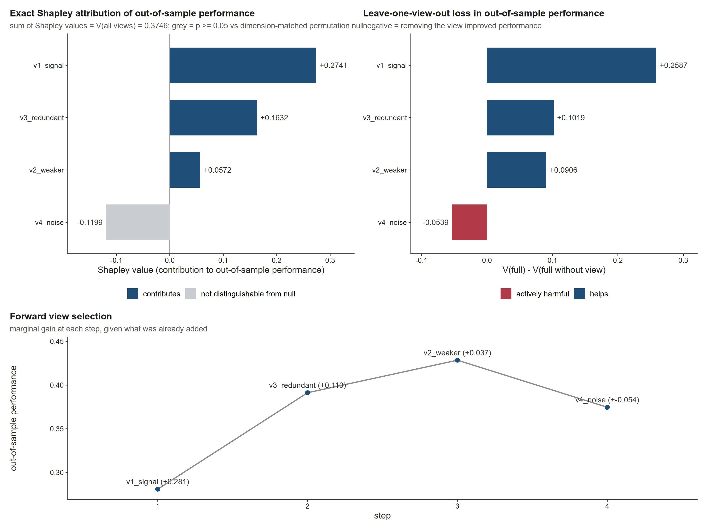

# recoverR

**Calibrated layer attribution and spatial recoverability for bulk multi-omics.**

`recoverR` answers two questions that existing multi-omics tooling does not.

---

## 1. Does adding an omics layer actually improve out-of-sample prediction?

Not "does it explain variance in a fitted model" — that is a different, easier,
and much less useful question.

* `variancePartition` decomposes variance across **named covariates** within a fitted model.
* `MOFA2` decomposes variance across **latent factors** within a fitted model.

Both are descriptive decompositions of a model that has already seen all the data.
Neither reports an **out-of-sample** attribution, and neither reports when an
added layer is actively *harmful*.

`recoverR` computes the **exact Shapley (LMG) decomposition** of a
cross-validated performance functional, plus a **dimension-matched permutation
null**, so "this layer adds nothing" comes back as a p-value and a confidence
interval rather than a bare R².

## 2. Can a bulk profile carry a spatially-defined phenotype at all?

Reliability layers now exist for **spatial deconvolution output** — they add a
risk map to RCTD/cell2location/Tangram predictions and ask *is this spot-level
spatial call trustworthy?* They all operate spatial → spatial.

None asks the inverse question, which is the one that decides whether a bulk
biomarker programme is viable: **given a bulk profile, is the spatial archetype
recoverable — and if not, can the method say so?**

`recoverR` provides split and Mondrian conformal prediction with an explicit
**abstention** rule. Abstention is the deliverable, not a shortcoming: a method
that returns a confident archetype for a profile that cannot support one is the
mechanism by which bulk biomarkers fail in clinical trials.

---

## Install

```r
# from a local checkout
install.packages("recoverR", repos = NULL, type = "source")

# optional integrations
install.packages(c("glmnet", "pROC", "survival", "patchwork", "svglite"))
BiocManager::install(c("MOFA2", "ComplexHeatmap"))
```

## Tutorial

**New here? Read [`TUTORIAL.md`](TUTORIAL.md).** It is a complete runnable walkthrough — every module
with its **real printed output** and figures, how to read each figure, the guardrails, what is and is
not validated, and the traps that quietly produce plausible wrong numbers. Its figures are regenerated
by `Rscript tutorial/make_tutorial.R` (deterministic; seeds are listed there).



## Mathematical specification

Every algorithm is specified in full in **[`ALGORITHMS.md`](ALGORITHMS.md)** — the estimator, its
assumptions, its validity argument and its computational cost, with the failure mode that forced each
non-negotiable design choice stated where one did. GitHub renders the `$…$` mathematics in that file
directly.

| § | what it specifies |
|---|---|
| 0 | notation |
| 1 | performance functionals — out-of-sample $R^2$, AUC via the Mann–Whitney form, Harrell's concordance index |
| 2 | the cross-validated value functional: the estimator, **nested selection**, **why the folds are shared**, and the `type.measure` trap |
| 3 | the **exact Shapley (LMG) decomposition** of $\mathcal{V}$: definition, why Shapley rather than a variance share, the unique/shared split, and exact-enumeration complexity |
| 4 | the **dimension-matched permutation null**: construction, what it preserves and what it destroys, and the p-value |
| 5 | ablation — leave-one-view-out and forward selection |
| 6 | **split and Mondrian conformal prediction with abstention**: the exchangeability assumption, the algorithm, nonconformity scores, the finite-sample **coverage guarantee**, class-conditional (Mondrian) conformal, weighted conformal under covariate shift, the abstention rule and selective-risk view, reliability/ECE, and **pairwise archetype separability** |
| 7 | sampling adequacy — pseudo-bulk construction, the **Hill saturation model**, the adequacy threshold, and why the scorer is deliberately simple |
| 8 | computational summary — the cost of each step |
| 9 | what these algorithms do **not** claim |
| 10 | references for the underlying methods |

## Quick start

```r
library(recoverR)

# X_list: named list of view matrices, samples x features, rows aligned
# y: a two-level factor, a numeric vector, or a Surv object
res <- attrib_views(X_list, y, family = "binomial", n_perm = 199)
res
#> <recoverR_attribution> 4 views | binomial endpoint
#>
#> Shapley decomposition of out-of-sample performance:
#>    view   shapley  V_alone  unique_contribution
#>     RNA    0.4021   0.5502               0.3180
#>     ...
#>
#> Dimension-matched permutation null:
#>   Methylation    delta = +0.0041   p = 0.6200  (B = 199)
#>   ...

plot_shapley(res)                     # hero panel
plot_attribution_plate(res)           # Shapley + LOO + forward
save_plot(plot_shapley(res), "figs/shapley")   # writes .pdf AND .jpeg
```

### Calibrated recoverability

```r
fit <- refit_recoverability(bulk_X, archetype, alpha = 0.10, mondrian = TRUE)
pred <- predict_recoverability(fit, new_bulk_X)

table(pred$abstain)                    # who the model refuses to call
archetype_separability(fit)            # which pairs bulk cannot separate
plot_separability(fit)                 # the actionable figure
```

### Sampling adequacy

```r
sa <- sampling_adequacy(spot_counts, coords, labels,
                        diameters = c(0.5, 1, 2, 3, 4, 5, 6))
sa
#> Adequacy thresholds:
#>   panel_genes  plateau  half_saturation_mm  adequacy_mm
#>           200    0.842                1.85         3.42
```

---

## The guardrails

Every function in `R/guardrails.R` exists because a real analysis silently
produced a wrong answer **without raising an error**. They are exported because
the failure modes are general:

| Wrapper | Failure it prevents |
|---|---|
| `cv_glmnet_safe()` | `cv.glmnet` silently downgrades `type.measure` from `"auc"` to `"deviance"` when folds hold < 10 observations, so `which.max(cv$cvm)` maximises **error** |
| `auc_safe()` | `pROC::roc.test()` errors at AUC = 1 — exactly where the strongest markers sit — and returns `NA`, which propagates through BH adjustment |
| `safe_cbind()` | Per-layer PCs are all named `PC1..PCn`, so `cbind` + `lm` returns `NA` for the combined model |
| `assert_no_na()` | `if (x) next` over an `NA`-containing vector fails with "missing value where TRUE/FALSE needed" |
| `detect_cna_levels()` | `paste0("C", NA)` yields the literal `"CNA"`, adding a phantom factor level that breaks `scale_fill_manual` at draw time |

## Figures

`save_plot()` writes **both** a vector PDF and a JPEG, and then **verifies** the
PDF is genuinely vector. That check matters: ggplot2 ≥ 3.5 rasterises continuous
colourbar legends by default, embedding a one-pixel bitmap strip in the PDF, and
`raster = FALSE` is deprecated and silently ignored in those versions. Use
`rr_guide_colourbar()` (or a discrete fill) and the figure stays editable.

```r
save_plot(p, "figs/panel")                      # pdf + jpeg, vector-verified
save_pub(p, "figs/panel1", width_mm = 183)      # svg + pdf + 600 dpi tiff
```

Plot functions: `plot_shapley()`, `plot_leave_one_out()`,
`plot_forward_selection()`, `plot_attribution_plate()`, `plot_ablation_bars()`,
`plot_variance_partition()`, `plot_reliability()`, `plot_coverage_risk()`,
`plot_separability()`, `plot_recoverability()`, `plot_sampling_curve()`.

---

## What this does **not** claim

* Shapley attribution is **associative, not causal**.
* Conformal coverage is **marginal** unless `mondrian = TRUE`, and degrades under
  distribution shift.
* **Abstention is not accuracy.** A model that abstains on hard cases is honest,
  not better.
* Nothing here substitutes for **external validation**.

Every exported function documents its own mathematics and behaviour (`?attrib_views`,
`?refit_recoverability`, `?sampling_adequacy`), including the
validity arguments, the complexity analysis, and the optimisations.

## Citation

If you use `recoverR`, cite the package and the accompanying analysis. See
`inst/CITATION`.

## License

MIT © Lingzhang Meng
