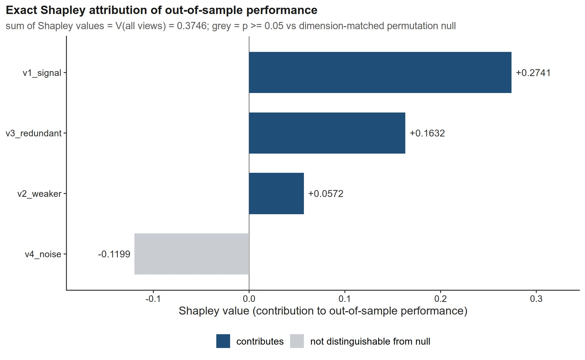
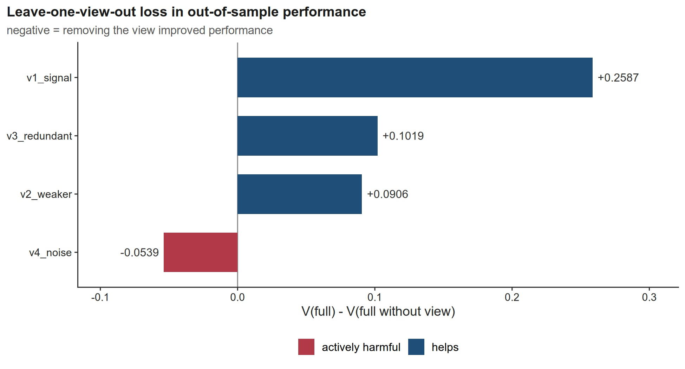
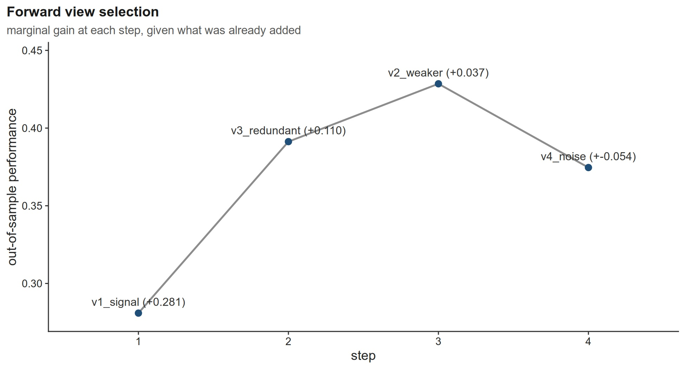
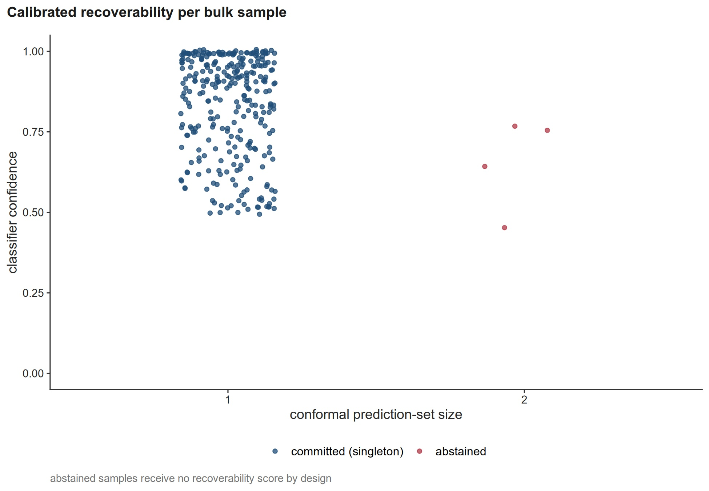
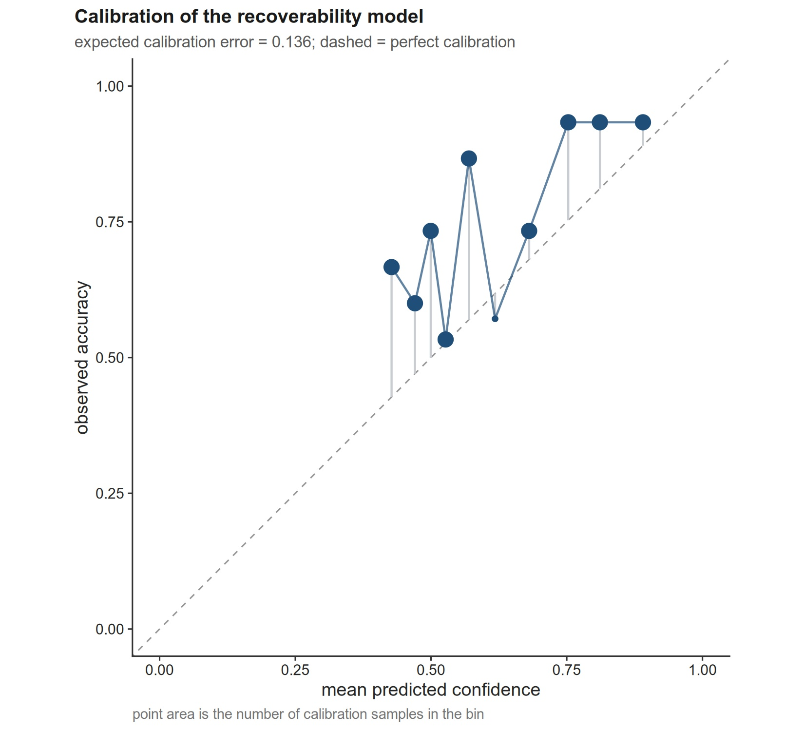
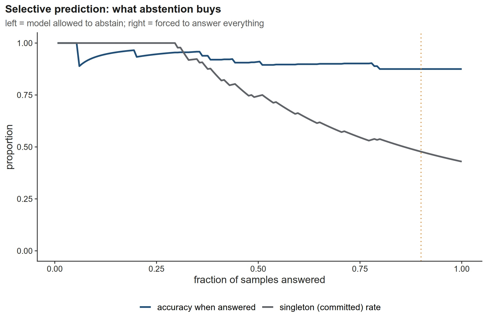
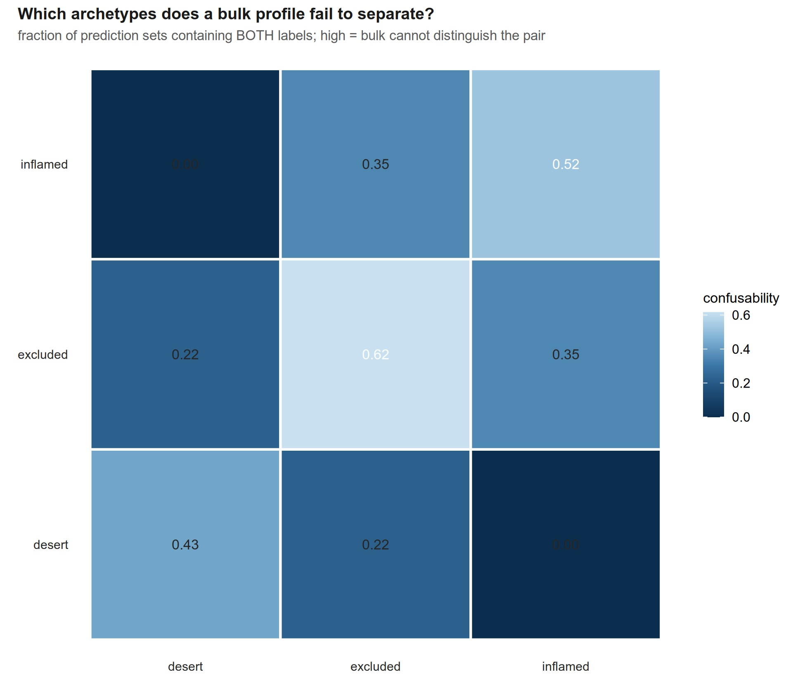
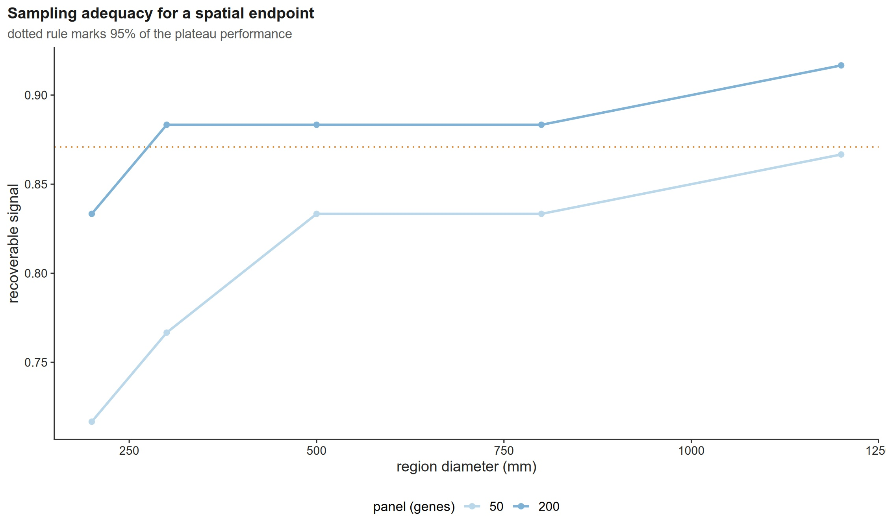

# `recoverR` — tutorial and reference

**Calibrated layer attribution and spatial recoverability for bulk multi-omics.**

This document is a complete, runnable walkthrough: what the package is for, how to install it, a
worked example of every module with the **real printed output** and the **real figures**, how to read
each figure, what is and is not validated, and the traps that produce plausible wrong numbers.

Every number and every figure below was generated by running the package —
`Rscript tutorial/make_tutorial.R`, which is shipped in this repository. Nothing here is hand-typed,
and the run is deterministic (seeds are listed in [§8](#8-reproducing-the-figures-and-tables)).

- [1. What the package is for](#1-what-the-package-is-for)
- [2. Install](#2-install)
- [3. Requirements and data shapes](#3-requirements-and-data-shapes)
- [4. Part 1 — attribution: does adding a layer help, and is it ever harmful?](#4-part-1--attribution)
- [5. Part 2 — recoverability: can a bulk profile carry a spatial phenotype?](#5-part-2--recoverability)
- [6. Part 3 — sampling adequacy: how much tissue, and how many genes?](#6-part-3--sampling-adequacy)
- [7. Guardrails and publication figures](#7-guardrails-and-publication-figures)
- [8. Reproducing the figures and tables](#8-reproducing-the-figures-and-tables)
- [9. API reference](#9-api-reference)
- [10. Validation status — what is and is not validated](#10-validation-status)
- [11. Known limitations and gotchas](#11-known-limitations-and-gotchas)

---

## 1. What the package is for

`recoverR` answers two questions that existing multi-omics tooling does not.

**Question 1 — does adding an omics layer improve *out-of-sample* prediction?** Not "does it explain
variance in a fitted model", which is a different and much easier question:

| existing tool | what it decomposes | why that is not this |
|---|---|---|
| `variancePartition` | variance across **named covariates** | descriptive, *within* a model that has already seen all the data |
| `MOFA2` | variance across **latent factors** | same, plus factors are not layers |
| a single-view ablation, run once | one fit, one algorithm | answers at one point of the parameter space only |

`recoverR` computes the **exact Shapley (LMG) decomposition of an out-of-sample performance
functional**, plus a **dimension-matched permutation null** — so "this layer adds nothing" comes back
as a p-value and a confidence interval rather than a bare R². It also reports the case nothing else
reports: a layer whose contribution is **negative**, i.e. actively harmful to held-out performance.

**Question 2 — can a *bulk* profile carry a spatially-defined phenotype at all, and with what
calibrated confidence?** A bulk profile is an average: a tumour that is part inflamed and part desert
averages to "moderately inflamed", which is a misleading summary. Reliability layers exist for spatial
*deconvolution* output; none asks the **inverse** question. `recoverR` answers it with split and
Mondrian **conformal prediction with abstention** — a prediction *set* per sample, a measured
reliability curve, and a **pairwise confusability matrix** naming which clinical distinction a bulk
assay will fail to deliver.

A third capability follows from the second: `sampling_adequacy()` turns tissue-extent and panel-size
constraints into a **measured design rule**, instead of an afterthought reported once for one study.

The five stances that shape every design choice:

1. **Predictive, not explanatory** — every quantity is measured on data the model did not see.
2. **Null-calibrated** — every claim is compared against a null matched to it by construction.
3. **Abstention is a result** — a tool that permits a confident wrong call reproduces the problem it
   exists to detect.
4. **No invented numbers** — nothing is fabricated to fill a gap.
5. **The failure mode is written down** — where a choice was forced by an observed failure, the failure
   is in the code comments, so the choice cannot be silently reverted.

---

## 2. Install

```r
# from GitHub (development version)
remotes::install_github("LingzhangMeng/recoverR")

# from a local checkout of this repository
#   R CMD INSTALL .        # shell, from the package root
# or, in R:
#   devtools::install("path/to/recoverR")
```

```r
library(recoverR)
packageVersion("recoverR")
#> [1] '0.1.3'
```

---

## 3. Requirements and data shapes

* **R ≥ 4.1.0.** `Imports` (installed automatically): `ggplot2`, `matrixStats`, `Matrix`, `MASS`,
  `stats`, `utils`, `grDevices`.
* **`Suggests`** — only needed by the features that use them: `glmnet` (the default cross-validated
  learner *and* the multinomial conformal learner), `pROC`, `survival` (Cox endpoints), `rhdf5`
  (`read_visium`), `ComplexHeatmap`, `circlize`, `patchwork`, `cowplot`, `ggrepel`, `ggdist`,
  `ggridges`, `scales`, `viridis`, `RColorBrewer`, `systemfonts`, `svglite`, `ragg`, `data.table`,
  `jsonlite`, `MOFA2`, `SNFtool`.

**The shapes the functions expect:**

| argument | shape | notes |
|---|---|---|
| `X_list` (attribution) | named list of **samples × features** matrices | rows **aligned** across views; views need not share columns |
| `y` | two-level factor (binomial), numeric (gaussian), or a `Surv` object | the endpoint family is declared, not inferred |
| `X` (recoverability) | **samples × features**, **named columns** | `predict_recoverability()` matches calibration and test matrices by feature identifier; an unnamed matrix shares no features with the training set |
| `counts` (spatial) | **spots × genes**, rownames matching `coords` | see `?pseudobulk_regions` |
| `coords` | data frame with `x`, `y` (and rownames = barcodes) | the **units are yours** — see the trap in [§11](#11-known-limitations-and-gotchas) |
| `labels` (spatial) | **named** vector keyed by barcode | spatial ground truth; unnamed labels + no `coords` rownames is a hard error |

---

## 4. Part 1 — attribution

**The synthetic design** (no study data is used anywhere in this tutorial): 120 samples, four views of
30 features. `v1_signal` carries the outcome, `v2_weaker` carries a weaker version of it,
`v3_redundant` is a **noisy copy of `v1`** — it shares `v1`'s signal but carries none of its own — and
`v4_noise` is pure noise.

```r
set.seed(20261005)
n <- 120L; y <- rnorm(n)
make_view <- function(p, signal, sd_noise = 1) {
  m <- matrix(rnorm(n * p), n, p)
  if (signal > 0) m[, 1] <- signal * y + rnorm(n)
  m + matrix(rnorm(n * p, sd = sd_noise), n, p)
}
X <- list(
  v1_signal    = make_view(30, 1.0),
  v2_weaker    = make_view(30, 0.6),
  v3_redundant = { z <- make_view(30, 1.0); z + matrix(rnorm(n * 30, sd = 1.5), n, 30) },
  v4_noise     = make_view(30, 0.0)
)
res <- attrib_views(X, y, family = "gaussian", nfolds = 5L, seed = 1L,
                    n_perm = 49L, ncores = 4L, verbose = FALSE)
res
```

```
<recoverR_attribution> 4 views | gaussian endpoint

Shapley decomposition of out-of-sample performance:
         view shapley V_alone unique_contribution
    v1_signal  0.2741  0.2809              0.2587
 v3_redundant  0.1632  0.2163              0.1019
    v2_weaker  0.0572  0.0259              0.0906
     v4_noise -0.1199 -0.1957             -0.0539
```

Read the two columns together:

* **`shapley`** — the view's total credit. It is *efficiency*-satisfying: the values sum to
  `V(full) − V(empty)` (here `V(full) = 0.3746`).
* **`unique_contribution`** — `V(full) − V(full \ k)`: what is lost when that view alone is removed.

**Notice the deliberately awkward result:** `v3_redundant` earns a *larger* Shapley value (0.1632) than
`v2_weaker` (0.0572), even though `v2_weaker` is the view that actually carries planted signal. That is
the redundancy effect, measured: a view correlated with a strong view inherits a share of its credit.
It is precisely why a bare variance share overstates a redundant layer, and why the null below matters
more than the point estimate.

### The dimension-matched permutation null

```r
as.data.frame(res$null)[, c("view", "delta_observed", "null_mean", "null_q95", "p_value")]
```

| view | delta_observed | null_mean | null_q95 | p_value |
|---|---|---|---|---|
| v1_signal | +0.2587 | +0.0410 | 0.0881 | 0.02 |
| v2_weaker | +0.0906 | +0.0288 | 0.0759 | 0.04 |
| v3_redundant | +0.1019 | +0.0083 | 0.0368 | 0.02 |
| v4_noise | −0.0539 | −0.0032 | 0.0241 | 1.00 |

*(B = 49 permutations per view, each an exact-size view of the same width.)*

The null is **dimension-matched by construction** — the permuted view has exactly as many features as
the real one, so no dimensionality correction is needed. Its hypothesis is precise:

> **H₀:** given the other views, this view carries no sample-specific information about `y`.

Two things worth internalising from the table:

* A pure-noise view has a **non-zero null mean** (+0.0410 for `v1_signal`'s null, for example): random
  columns act a little like noise-injection regularisation. This is why a permutation null is needed
  rather than a bare R².
* Therefore **"assert p > 0.05 for a noise view" is a bad test** — p is uniform under H₀, so it fails
  about 5% of the time by design. The stable discriminator is the **gap to the null mean**, which is
  why the package reports it.

### Leave-one-out, forward selection, and the harm flag

```r
res$ablation$leave_one_out
res$ablation$forward
```

| view | V_without | loss_when_removed |
|---|---|---|
| v1_signal | 0.1159 | +0.2587 |
| v3_redundant | 0.2727 | +0.1019 |
| v2_weaker | 0.2840 | +0.0906 |
| **v4_noise** | **0.4285** | **−0.0539** |

| step | view added | marginal gain | V after the step |
|---|---|---|---|
| 1 | v1_signal | +0.2809 | 0.2809 |
| 2 | v3_redundant | +0.1104 | 0.3913 |
| 3 | v2_weaker | +0.0372 | 0.4285 |
| 4 | **v4_noise** | **−0.0539** | **0.3746** |

**This is the package's central finding in one table.** Adding `v4_noise` to the model *reduces*
out-of-sample performance (0.4285 → 0.3746), and removing it *increases* it. A negative loss is
invisible to any variance decomposition — it can only be seen out-of-sample.


*Above: `plot_attribution_plate(res)` — Shapley values (left), leave-one-view-out loss with the harmful
view in red (right), forward selection (bottom). Render it wide: this figure needs at least ~9 in of
width or the two top panel titles collide (see [§11](#11-known-limitations-and-gotchas)).*



*`plot_shapley(res)` — the same decomposition on its own. Grey bars are views that are not
distinguishable from their null (here `v4_noise`, which is also the negative one).*





**How to read them.** `plot_leave_one_out()` and `plot_forward_selection()` are the two directions of
the same question: LOO asks what is lost *without* a view given all the others; forward asks what is
gained *with* it given what has already been added. A view that looks good on one and bad on the other
is redundant, not informative.

---

## 5. Part 2 — recoverability

The predictor sees only the **aggregated** profile of a region, while the label is the **spatial**
archetype. Nothing about the label enters the feature vector, so the test is not circular: it measures
exactly what aggregation destroys.

```r
set.seed(20261005)
nr <- 300L
lab   <- sample(c("inflamed", "excluded", "desert"), nr, replace = TRUE)
shift <- c(inflamed = 1.2, excluded = -0.2, desert = -1.4)[lab]
Xr <- matrix(rnorm(nr * 40), nr, 40)
Xr[, 1] <- shift + rnorm(nr, sd = 0.9)
Xr[, 2] <- shift + rnorm(nr, sd = 1.1)
colnames(Xr) <- sprintf("g%02d", seq_len(ncol(Xr)))   # features MUST be named
table(lab)
#> desert excluded inflamed
#>     93      109       98

fit <- refit_recoverability(Xr, factor(lab), alpha = 0.10, mondrian = TRUE,
                            score = "aps", cal_prop = 0.5, seed = 1)
```

```
LDA is ill-conditioned with 40 features and 151 training samples (fewer than 5 samples
per feature); switching to the glmnet multinomial learner. Set learner = "glmnet"
explicitly to silence this.

calibration coverage: 0.946 (target 0.90)
coverage by class:
  desert excluded inflamed
   0.957    0.926    0.959
```

> **That warning is the package working, not the package complaining.** `MASS::lda()` returns
> *saturated* posteriors when features outnumber training samples — confidence ≈ 1.0 at chance
> accuracy. The guard detects the ill-conditioning as a **ratio** (fewer than 5 training samples per
> feature) and substitutes `glmnet` instead of emitting a confident wrong answer. Name the learner
> yourself to silence it: `refit_recoverability(..., learner = "glmnet")`. The guard's criterion is
> itself regression-tested on a planted zero-noise signal, in both directions.

Split conformal prediction carries a finite-sample coverage guarantee; **Mondrian** (class-conditional)
conformal makes it hold *per class* rather than only on average — which is why the per-class coverage
above is reported next to the marginal number, and why at `alpha = 0.10` all four are ≈ 0.90 or better.

### Prediction sets and abstention

```r
pred <- predict_recoverability(fit, Xr)
```

| call | set_size | abstain | confidence |
|---|---|---|---|
| excluded | 1 | FALSE | 0.7248 |
| excluded | 1 | FALSE | 0.5881 |
| inflamed | 1 | FALSE | 0.9926 |
| excluded | 1 | FALSE | 0.4988 |
| desert | 1 | FALSE | 0.9512 |
| inflamed | 1 | FALSE | 0.5643 |

```
abstention: 4 of 300 regions (1.3%)
```

A **singleton** set is a committed call; a larger set is an abstention. Abstention is the deliverable,
not a shortcoming: the method is allowed to say *"this profile cannot support a call"* rather than
emitting a confident archetype where the data do not warrant one. (This synthetic signal is strong
enough that abstention is rare here — 4 of 300. On real bulk-to-spatial data it is not.)

### The confusability matrix — the actionable output

```r
archetype_separability(fit)
```

```
         desert excluded inflamed
desert    0.430    0.221    0.000
excluded  0.221    0.617    0.349
inflamed  0.000    0.349    0.523
attr(,"role")
[1] "confusability: high = bulk cannot separate the pair"
```

**⚠️ Read the direction carefully: this is a *confusability* matrix, so a HIGH value means the pair
**cannot** be told apart.** The diagonal is the fraction of regions in which each archetype appears in
the prediction set at all; the off-diagonals are the pairs that co-occur in sets, i.e. the distinctions
the aggregate profile cannot resolve. Here the off-diagonal range is 0.000 to 0.349, and the worst pair
is `excluded`·`inflamed` (0.349) — so *that* is the clinical distinction a bulk assay would blur,
while `desert`·`inflamed` (0.000) is delivered cleanly.



*`plot_recoverability(pred)` — the per-region verdict, with abstentions visible.*



*`plot_reliability(fit)` — confidence against observed accuracy (here ECE = 0.136). A reliability curve
is what lets you say "0.9 means 0.9" rather than assuming it.*



*`plot_coverage_risk(fit)` — the trade-off the abstention rule makes explicit. This sweep has **149
operating points** spanning **0.7% to 100%** answered:* `accuracy` among answered regions is **1.000**
at 0.7% coverage and **0.875** at 99.3% coverage, while at 50.3% coverage it is **0.9107** with a mean
prediction-set size of 1.253. `selective_gain()` returns the same table.



*`plot_separability(fit)` — the matrix above as a figure.*

---

## 6. Part 3 — sampling adequacy

Spatial signal collapses below a certain specimen size, and that constraint is usually reported once,
as an afterthought, for one study. `sampling_adequacy()` turns it into a measured quantity: **at what
region diameter does the archetype stop being recoverable from the aggregate profile — and how does
that depend on the panel size?**

```r
set.seed(11)
nside <- 40L; pitch <- 50; n_spot <- nside * nside
spots  <- sprintf("s%05d", seq_len(n_spot))
coords <- data.frame(x = rep(seq_len(nside), each = nside) * pitch,
                     y = rep(seq_len(nside), times = nside) * pitch,
                     barcode = spots, row.names = spots)
ext    <- nside * pitch
field  <- sin(2*pi*(coords$x - ext/2)/6000) + 0.7*cos(2*pi*(coords$y - ext/2)/7000)
labels <- setNames(ifelse(field > 0, "inflamed", "desert"), spots)
cnt <- matrix(rpois(n_spot * 200, 5), nrow = n_spot,
              dimnames = list(spots, paste0("GENE", seq_len(200))))
cnt[,   1:25] <- cnt[,   1:25] + pmax(0,  field) * 6
cnt[, 26:50] <- cnt[, 26:50] + pmax(0, -field) * 6

sa <- sampling_adequacy(cnt, coords, labels = labels,
                        diameters = c(200, 300, 500, 800, 1200),
                        panel_sizes = c(50, 200), n_regions = 60L,
                        target = 0.95, seed = 1L)
```

| diameter | panel_genes 50 | panel_genes 200 |
|---|---|---|
| 200 | 0.7167 | 0.8333 |
| 300 | 0.7667 | 0.8833 |
| 500 | 0.8333 | 0.8833 |
| 800 | 0.8333 | 0.8833 |
| 1200 | 0.8667 | 0.9167 |

```r
sa$adequacy[, c("panel_genes", "plateau", "half_saturation_mm", "adequacy_mm", "extrapolated")]
```

| panel_genes | plateau | half_saturation_mm | adequacy_mm | extrapolated |
|---|---|---|---|---|
| 50 | 0.8841 | 61.03 | **687.4** | FALSE |
| 200 | 0.8999 | 71.35 | **233.8** | FALSE |

**This is a design rule with a number on it:** to reach 95% of the plateau, a 50-gene panel needs a
region roughly **three times the diameter** that a 200-gene panel needs (687 versus 234 units here).
Panel size and tissue size trade against each other, and this function is how you price that trade.



*`plot_sampling_curve(sa$surface, adequacy = 0.95)` — recoverable signal against region diameter, one
curve per panel size. The dotted rule marks 95% of the highest plateau in the data.*

### What the tool refuses to do, and why that matters more

The design above is deliberately *adequate*: the class scale (wavelengths of 6000/7000 units) is large
relative to the largest region sampled (1200), so bigger regions really do average more spots and the
plateau is identifiable. Sweep the **same endpoint over diameters that are all too coarse** and the
answer changes shape:

| diameter | panel_genes 50 | panel_genes 200 |
|---|---|---|
| 400 | 0.8000 | 0.9167 |
| 800 | 0.8333 | 0.8833 |
| 1600 | 0.8833 | 0.9167 |
| 2000 | NA | NA |
| 2400 | NA | NA |

| panel_genes | plateau | adequacy_mm | extrapolated |
|---|---|---|---|
| 50 | NA | NA | NA |
| 200 | NA | NA | NA |

Here the fit is **rejected** — no plateau is identified, so no diameter is reported. That is the
honest behaviour, and it is what you want in a paper: `extrapolated = TRUE` means the fitted
half-saturation lies *outside* the sampled range, so the required diameter is **an extrapolation, not a
measurement**, and the sentence to write is *"the required diameter exceeds what we measured"* — never
a number.

---

## 7. Guardrails and publication figures

`recoverR` wraps the failure modes that are **silent** rather than loud — the kind that return a
plausible number instead of an error.

```r
assert_no_na(matrix(c(1, NA, 3)))
#> Error: x contains 1 NA value(s) (33%). Filter them explicitly or replace them with an
#> intended value; do not let them reach a boolean condition.

is_vector_pdf(tmp)
#> [1] TRUE
```

| helper | the silent failure it catches |
|---|---|
| `assert_no_na()` | NA introduced by a join, which then propagates into every fit |
| `cv_glmnet_safe()` | `cv.glmnet` silently downgrading `type.measure = "auc"` to `"deviance"` when folds hold < 10 observations, so `which.max(cvm)` maximises *error* |
| `auc_safe()` | `pROC::roc.test` erroring at AUC = 1 and returning `NA`, which survives BH adjustment unnoticed |
| `is_vector_pdf()` | ggplot2 rasterising a continuous colourbar legend into a 1-px strip inside a "vector" PDF |
| `assert_palette_covers()` | a palette that silently drops a factor level, recolouring the wrong group |
| `safe_cbind()` | duplicate column names from per-layer PCA scores, which make `lm()` return `NA` |
| `need_pkg()` | an optional dependency missing at the point of use, rather than `NULL` propagating |

### Figures as both a JPEG and a vector PDF

`save_plot()` writes **both** formats at a chosen size and verifies the pair; `save_pub()` writes a
journal-width pair (millimetres) and verifies that the PDF is genuinely vector:

```r
plt <- plot_shapley(res)
save_pub(plt, "figs/shapley", width_mm = 183, height_mm = 90)
# figs/shapley.pdf and figs/shapley.jpeg — both written
is_vector_pdf("figs/shapley.pdf")
```

Every figure in this tutorial was written this way — the JPEGs you see above are the same objects as
the PDFs beside them in `man/figures/`.

---

## 8. Reproducing the figures and tables

```bash
Rscript tutorial/make_tutorial.R      # from the package root; writes man/figures/*.pdf + *.jpeg
```

The build prints every table quoted above and asserts, for each figure, that **both** formats exist
and that the PDF is vector. Determinism comes from the seeds below — they are the reason a shown panel
can be reproduced exactly:

| part | seed(s) |
|---|---|
| data generation (Parts 1 and 2) | `set.seed(20261005)` |
| attribution (`attrib_views`) | `seed = 1L` |
| conformal fit (`refit_recoverability`) | `seed = 1` |
| spatial lattice (Part 3) | `set.seed(11)` |
| sampling sweep (`sampling_adequacy`) | `seed = 1L` |

Environment used for the output above: **`recoverR` 0.1.3, R 4.6.1**.

---

## 9. API reference

**Attribution and cross-validated performance**
`attrib_views()` (top-level entry point) · `shapley_attribution()` · `ablate_views()` ·
`permutation_null()` · `cv_perf()` · `cv_glmnet_safe()` · `auc_safe()`

**Recoverability (conformal)**
`fit_recoverability()` · `refit_recoverability()` · `predict_recoverability()` ·
`reliability_curve()` · `archetype_separability()` · `selective_gain()` · `coverage_risk_curve()`

**Spatial input and archetypes**
`read_visium()` · `rr_spatial_programmes()` · `spot_compartment()` · `derive_spatial_archetypes()` ·
`section_archetype()` · `pseudobulk_regions()` · `sampling_adequacy()` · `read_roi_table()`

**Plots**
`plot_shapley()` · `plot_leave_one_out()` · `plot_forward_selection()` · `plot_ablation_bars()` ·
`plot_variance_partition()` · `plot_attribution_plate()` · `plot_recoverability()` ·
`plot_reliability()` · `plot_coverage_risk()` · `plot_separability()` · `plot_sampling_curve()`

**Figures and theme**
`save_plot()` · `save_pub()` · `is_vector_pdf()` · `theme_audit()` · `rr_base_family()` · `rr_pal()` ·
`rr_scale_seq()` · `rr_scale_div()` · `rr_guide_colourbar()` · `rr_finish()` · `rr_caption_n()`

**Guards**
`assert_no_na()` · `safe_cbind()` · `assert_palette_covers()` · `detect_cna_levels()` ·
`cv_glmnet_safe()` · `need_pkg()`

Use `?function_name` for each one's documented arguments, mathematics and return value.

---

## 10. Validation status

Stated plainly, because a methods package that oversells itself is the problem it exists to detect.

**Validated.**

* **The estimator** (Layer attribution) — regression-tested, including against planted signals with a
  known answer, and calibrated with a dimension-matched null whose behaviour under H₀ is measured
  rather than asserted.
* **The conformal harness** (Recoverability) — verified by a **positive control**: on a fully planted,
  zero-noise signal it must reach accuracy ≥ 0.90, ECE ≤ 0.10 and abstention ≤ 0.05, and it does
  (`acc 0.954 / ECE 0.029 / abstention 0.000` on the calibration fixture). The learner guard that this
  control exposed is fixed and regression-tested in both directions, including recovery at
  `p == n`.
* **Finite-sample coverage** — split and Mondrian conformal prediction's guarantee holds by
  construction; the empirical coverage is reported beside it so a user can see it.

**Not validated.**

* **No independent ground truth for the recoverability module.** Its labels are, so far, either
  synthetic or a transcriptome-derived proxy. A real-data validation requires spatially defined labels
  measured *independently of the transcriptome* — for example multiplex immunofluorescence on clinical
  material. Until that exists, read real-data output as calibrated **relative to its own labels**, and
  read the abstention rate as a property of the data and the layer rather than as a defect.
* **No "which layer helps" guarantee.** The package measures a layer's out-of-sample contribution and
  its gap to a matched null; it cannot tell you what to do with a positive result.

---

## 11. Known limitations and gotchas

1. **Coordinates carry your units, and the plot says "mm".** `sampling_adequacy()`'s `diameters` are in
   the units of `coords`, and the millimetre columns — and the x-axis label — simply inherit them. A
   hard-coded pixel-to-micrometre constant is a classic silent error: a Visium spot's **diameter** is
   55 µm but its **pitch** is 100 µm, and the pixels-per-µm scale is image-dependent. Verify your units;
   do not trust the axis label.
2. **A big region averages your classes together.** If the class scale is small relative to the region
   you sample, accuracy *falls* with diameter and no plateau is identifiable — the fit is rejected
   (correctly; see [§6](#6-part-3--sampling-adequacy)). The class scale must be large relative to the
   largest diameter, or the adequacy question is not answerable by this design.
3. **`plot_sampling_curve()` draws one dotted rule, from the highest plateau in the data.** With two
   panel sizes the rule is a single visual reference, not a per-panel `d*`. The per-panel numbers are in
   `sa$adequacy` — read those, not the line.
4. **`plot_attribution_plate()` needs width.** Below roughly 9 in the two top panel titles overlap.
   Render it wide (this tutorial uses 10 × 7.5 in).
5. **The learner guard changes the learner for you.** When `MASS::lda()` would be ill-conditioned, the
   package substitutes `glmnet` and warns. That is deliberate. Name `learner = "glmnet"` yourself if you
   want a silent run.
6. **Abstention means what it says.** A non-singleton prediction set is not a missing value; it is the
   method declining to commit. Report it as a rate with its denominator.
7. **Feature names matter.** `predict_recoverability()` matches by column name; an unnamed test matrix
   shares no features with the training set and the function says so rather than silently scoring
   nothing.

---

## Licence and citation

MIT — see `LICENSE`. Author and maintainer: **Prof. Lingzhang Meng** (`lzmeng@gxams.org.cn`).

If you use `recoverR`, cite the package and the accompanying methods paper (in preparation).
